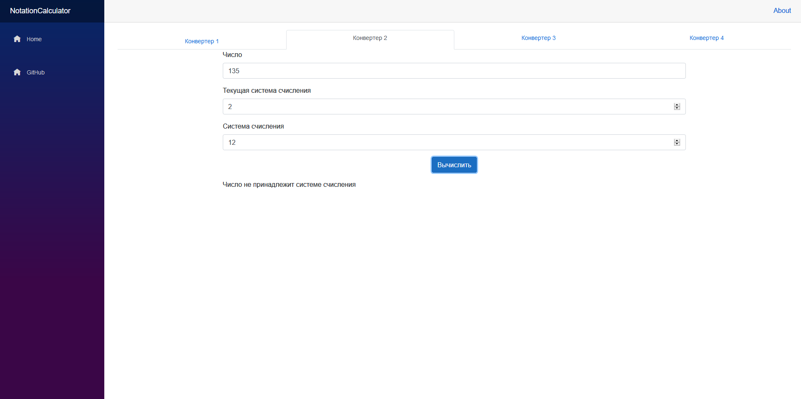

# blazor-numsys-converter
Convert any numeral systems.

What is it? It's a simple Single Page Application using Blazor Framework. 
Only Frontend and it's written in C#.
You can use components from this project in your Blazor Apps.

